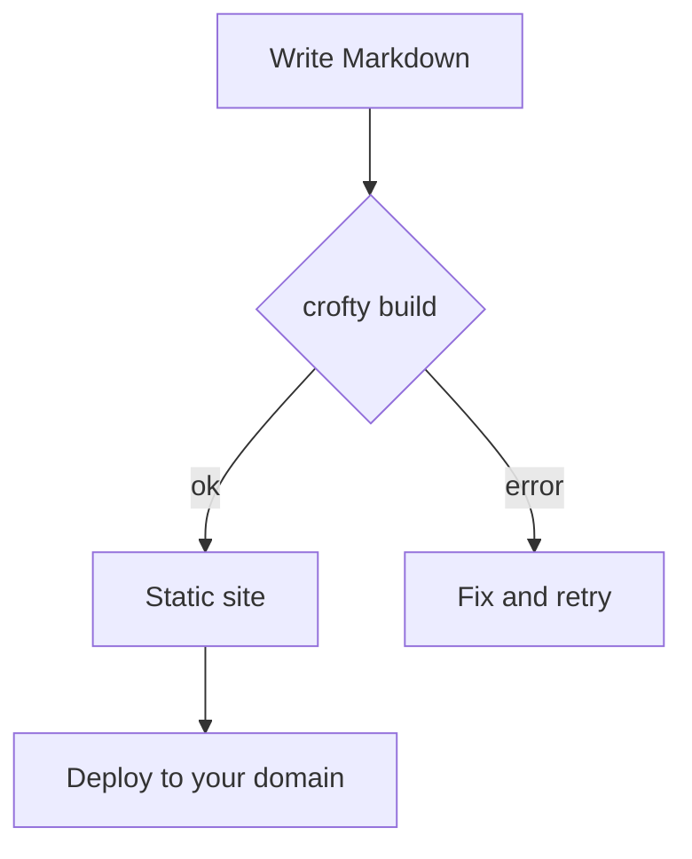
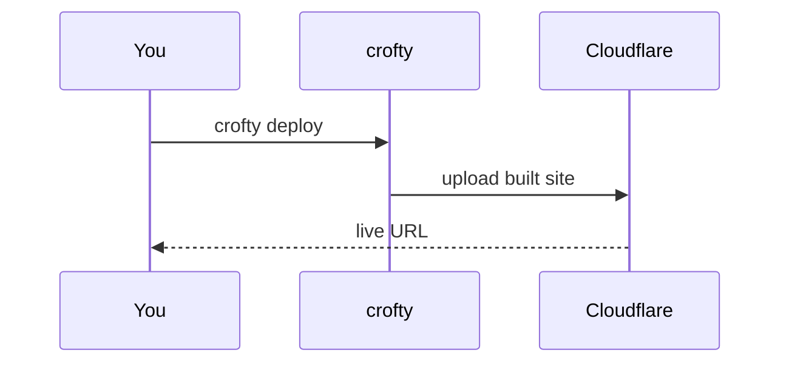
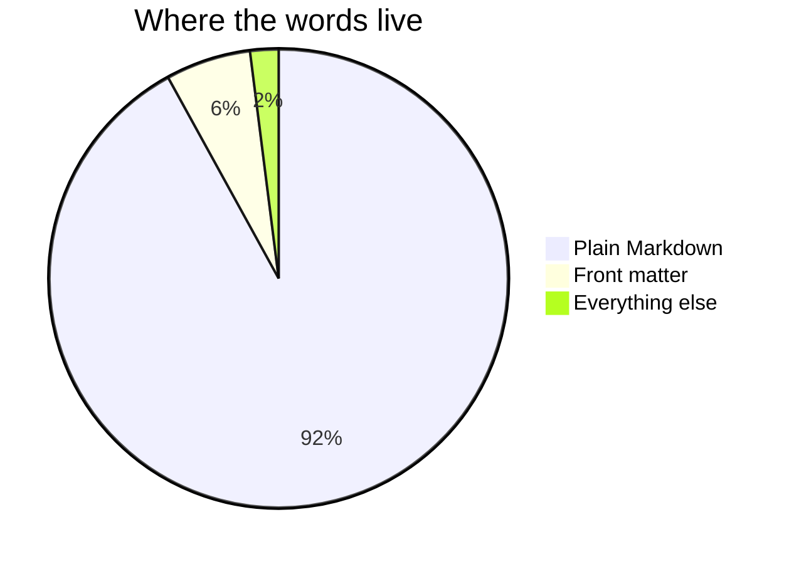

Mermaid turns a fenced code block into a diagram. You write the relationships in
text; the browser draws them. A project render hook (`render-codeblock-mermaid`)
loads Mermaid only on pages that use it, and the diagrams follow your light/dark
setting.

## A flowchart

## A sequence diagram

## A pie chart

The source stays plain text in your post, so a diagram is as portable — and as
diff-able — as the prose around it.
