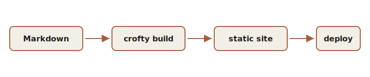

Images live right next to the post that uses them. This post is a *page bundle*
— a folder holding `index.md` and its pictures — so the files travel together
and the links never break.

## A plain Markdown image

The standard syntax is ``. Here is an SVG that shipped in this
folder:

Alt text is not optional dressing — it is what a screen reader announces and
what shows if the image ever fails to load. Write it like a caption you would
say out loud.

## A figure with a caption

When a picture needs a credit or a caption, raw HTML works too (this site turns
on Hugo's `unsafe` Markdown so your own HTML passes through):

<figure>
  
  <figcaption>From a folder of Markdown to a deployed site, in one step.</figcaption>
</figure>

## Inline, in a sentence

An image can also sit inline, at the size of the surrounding text — handy for a
small icon  dropped mid-sentence. (That uses a
little raw HTML to set the height; a plain `` image always renders at its
full size as its own block, which usually reads better for real pictures.)

That is the whole toolkit for pictures: a file in the folder and a line of
Markdown pointing at it.
