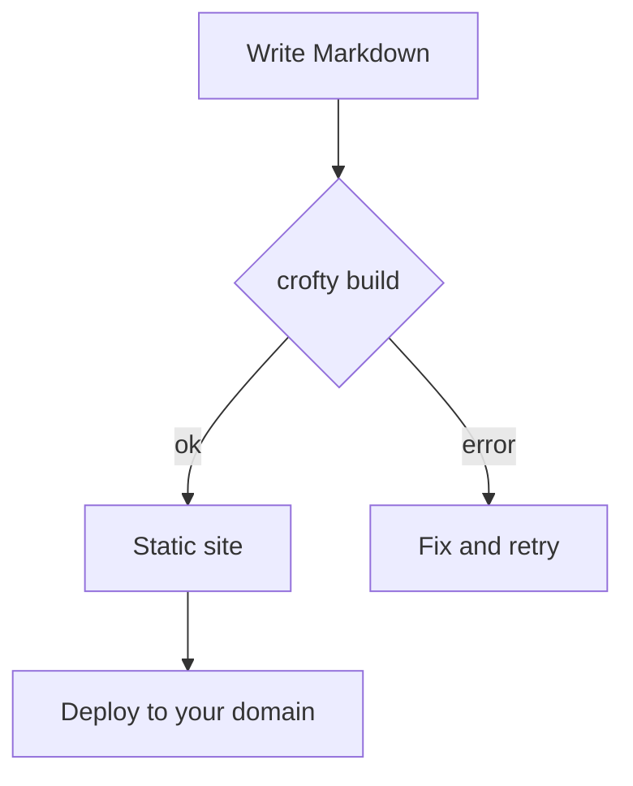
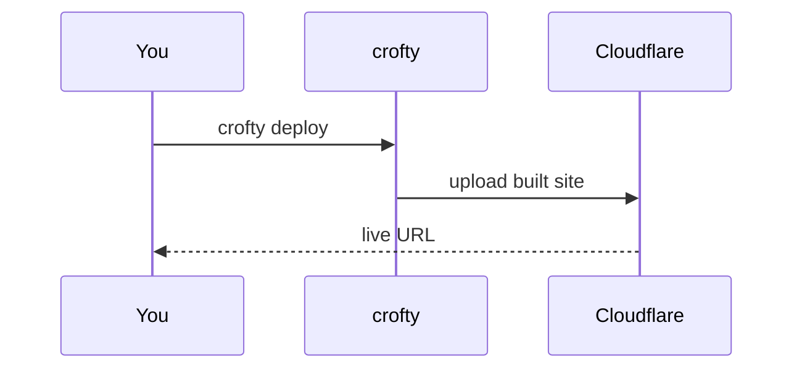
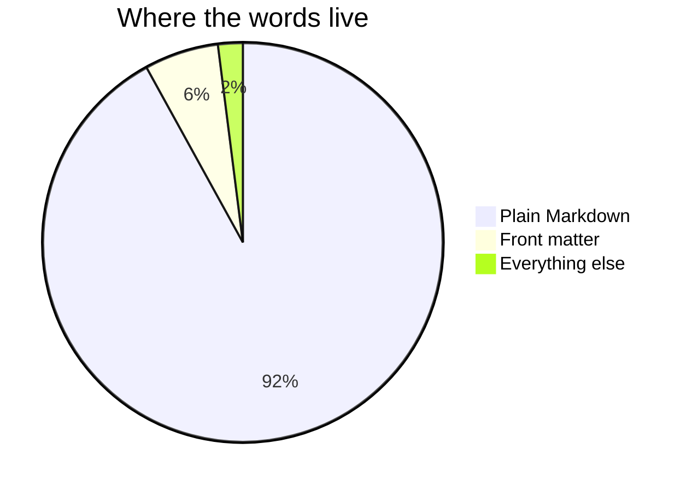

Mermaid はフェンス付きコードブロックを図に変える。あなたは関係をテキストで書き、
ブラウザがそれを描く。プロジェクトのレンダーフック（`render-codeblock-mermaid`）が
それを使うページにだけ Mermaid を読み込み、図はあなたのライト／ダーク
設定に追随する。

## フローチャート

## シーケンス図

## 円グラフ

ソースは記事のなかで素のテキストのままなので、図はその周りの散文と同じくらい
持ち運びやすく──そして差分も取りやすい。
